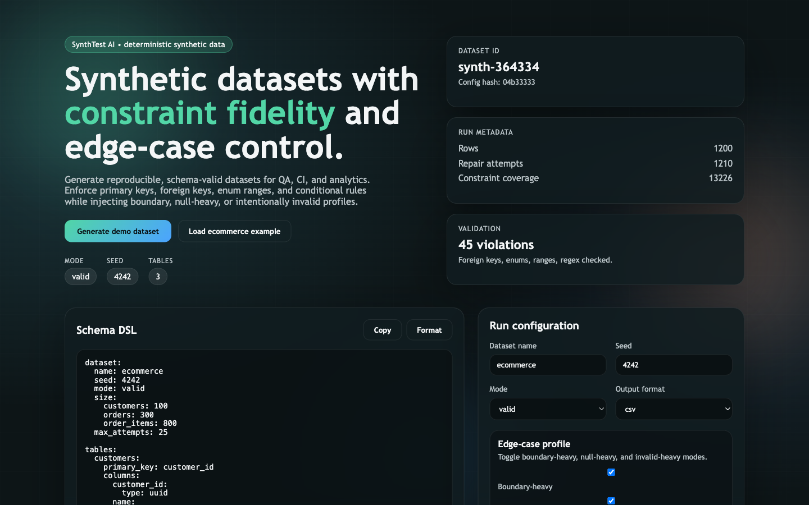
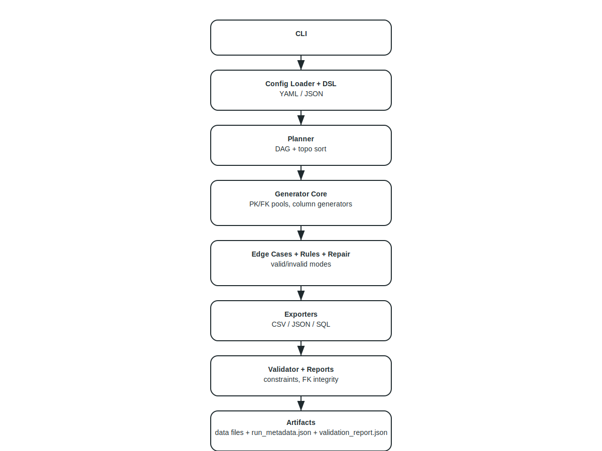
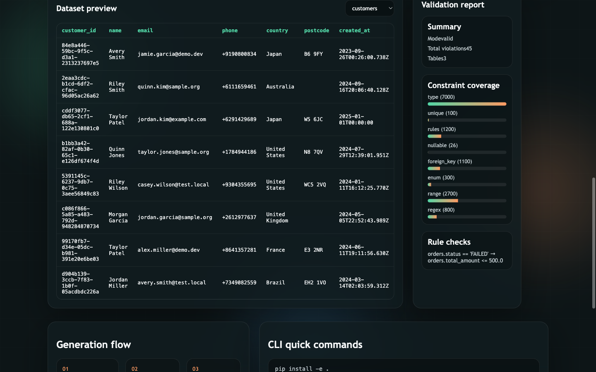
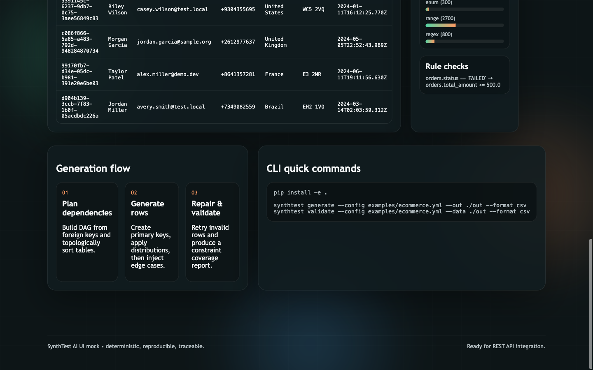

# SynthTest AI — Deterministic Synthetic Data Generator

<div align="center">


**Generate realistic, compliant, repeatable datasets from schemas for QA, CI, and analytics.**

[Features](#-features) | [Architecture](#-architecture) | [Quick Start](#-quick-start) | [CLI](#-cli) | [Screenshots](#-screenshots)

---



</div>

---

## Overview

SynthTest AI is a **schema-driven synthetic data generator** focused on **determinism**, **constraint validity**, and **referential integrity** across multi-table datasets. It supports edge-case injection and invalid data modes for validator testing, while producing structured run metadata and validation reports.

> **Portfolio Demonstration** — This project highlights end-to-end product engineering: a schema DSL, dependency planner, generators, validators, exporters, CLI tooling, and a UI mock for storytelling.

### Key Highlights

| Aspect | Description |
|--------|-------------|
| **Deterministic Output** | Global seed + per-table derived seeds for repeatable datasets |
| **Constraint Fidelity** | Enforces types, ranges, regex, unique keys, enums, FK integrity |
| **Multi-Table Planning** | DAG planner with topological ordering |
| **Edge-Case Profiles** | Boundary-heavy, null-heavy, invalid-heavy injection |
| **Rules Engine** | Safe expression evaluation for conditional constraints |
| **Validation Reports** | Constraint coverage metrics + repair attempts |
| **Exporters** | CSV, NDJSON, and SQL inserts |
| **UI Demo** | Static product UI for portfolio presentation |

---

## Features

### Data Generation Engine
- **Primary/foreign key integrity** across multiple tables
- **Column generators**: uuid, int, decimal, bool, datetime, date, enum, text, email, phone, country, postcode_uk, name
- **Distributions**: uniform, normal, lognormal, categorical weights
- **Edge-case modes**: boundary-heavy, null-heavy, invalid-heavy
- **Deterministic seeds**: reproducible datasets every run

### Validation & Reporting
- Schema validation (types, ranges, regex, enum, nullability, uniqueness)
- Referential integrity checks
- Rule evaluation per row
- Repair loop for valid mode (retry to satisfy constraints)
- Structured report with constraint coverage counts

---

## Architecture

```

<div align="center">

</div>

---

## Tech Stack

### Core
| Technology | Purpose |
|------------|---------|
| **Python 3.11+** | Primary runtime and CLI |
| **Pydantic 2.x** | Schema models and validation |
| **PyYAML** | YAML schema parsing |
| **Pytest** | Unit + integration tests |

### Optional / Planned
| Technology | Purpose |
|------------|---------|
| **FastAPI** | Optional REST API (not implemented in MVP) |
| **PostgreSQL introspection** | Stubbed for future release |

---

## Quick Start

### Prerequisites
- Python 3.11+
- pip

### Installation
```bash
cd synthtest-ai
python3 -m venv .venv
source .venv/bin/activate  # Windows: .venv\Scripts\activate
pip install -e .
```

### Generate Dataset
```bash
synthtest generate --config examples/ecommerce.yml --out ./out --format csv
```

### Validate Dataset
```bash
synthtest validate --config examples/ecommerce.yml --data ./out --format csv
```

Outputs are written to `./out/`:
- `customers.csv`, `orders.csv`, `order_items.csv`
- `run_metadata.json`
- `validation_report.json`

---

## CLI

### Initialize project assets
```bash
synthtest init
```

### Generate data
```bash
synthtest generate --config examples/ecommerce.yml --out ./out --format csv
```

### Validate data
```bash
synthtest validate --config examples/ecommerce.yml --data ./out --format csv
```

### Infer basic schema from CSV
```bash
synthtest infer-basic --input sample.csv --out schema.yml
```

---

## Schema DSL

### Example
```yaml
dataset:
  name: ecommerce
  seed: 4242
  mode: valid
  size:
    customers: 100
    orders: 300
    order_items: 800
  max_attempts: 25

tables:
  orders:
    primary_key: order_id
    foreign_keys:
      - column: customer_id
        ref_table: customers
        ref_column: customer_id
    columns:
      order_id: { type: uuid }
      customer_id: { type: uuid }
      status:
        type: enum
        values: [PAID, FAILED, REFUNDED]
        weights: [0.7, 0.2, 0.1]
      total_amount:
        type: decimal
        range: [0, 2000]
        distribution: lognormal

rules:
  - if: "orders.status == 'FAILED'"
    then:
      - "orders.total_amount <= 500.0"
```

### Column fields
- `type`: uuid | int | decimal | datetime | date | bool | enum | text | email | phone | country | postcode_uk | name
- `nullable`: bool
- `unique`: bool
- `range`: [min, max] (numeric/date/datetime)
- `regex`: regex for text
- `values` + `weights`: enum values + categorical weights
- `distribution`: uniform | normal | lognormal | categorical
- `length`: [min, max] for text
- `pii`: bool (used by inference and PII guard)

---

## Valid vs Invalid Mode
- **valid**: enforces constraints, retries failed rows, aims for zero violations
- **invalid**: injects type/regex/fk violations to stress downstream validators

Edge-case profile behaviors:
- boundary-heavy values for numeric/string ranges
- null-heavy values respecting nullability
- invalid-heavy values that break schema rules

---

## Validation Report (Example)
```json
{
  "dataset": "ecommerce",
  "mode": "valid",
  "total_violations": 0,
  "constraint_coverage": {
    "type": 1200,
    "nullable": 1200,
    "range": 600,
    "regex": 200,
    "enum": 300,
    "unique": 100,
    "foreign_key": 800,
    "rules": 300
  },
  "tables": {
    "orders": {
      "table": "orders",
      "row_count": 300,
      "violations": {},
      "rule_violations": 0,
      "failed_rows": 0,
      "constraint_coverage": {"type": 1200},
      "repair_attempts": 320
    }
  }
}
```

---

## UI Demo (Static)
A static UI mock is included for portfolio presentation.

```bash
cd synthtest-ai
python3 -m http.server 8000
```
Open `http://localhost:8000/ui/` in your browser.

---

## Screenshots

### Hero / Overview


### Dataset Preview + Validation


### Flow + CLI Panel


---

## Project Structure
```
synthtest-ai/
  synthtest/
    cli.py
    config/
    schema/
    plan/
    gen/
    validate/
    export/
    util/
  examples/
  docs/
  tests/
  ui/
```

---

## Test Results

**Latest local run (2026-02-02):**
```
6 passed in 0.52s
```

---

## Limitations (MVP)
- PostgreSQL introspection is stubbed (planned feature)
- Regex-based text generation supports common patterns, not full regex coverage
- REST API is not included in this MVP

---

## License
MIT
